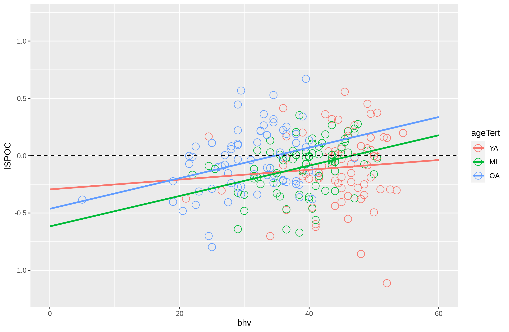
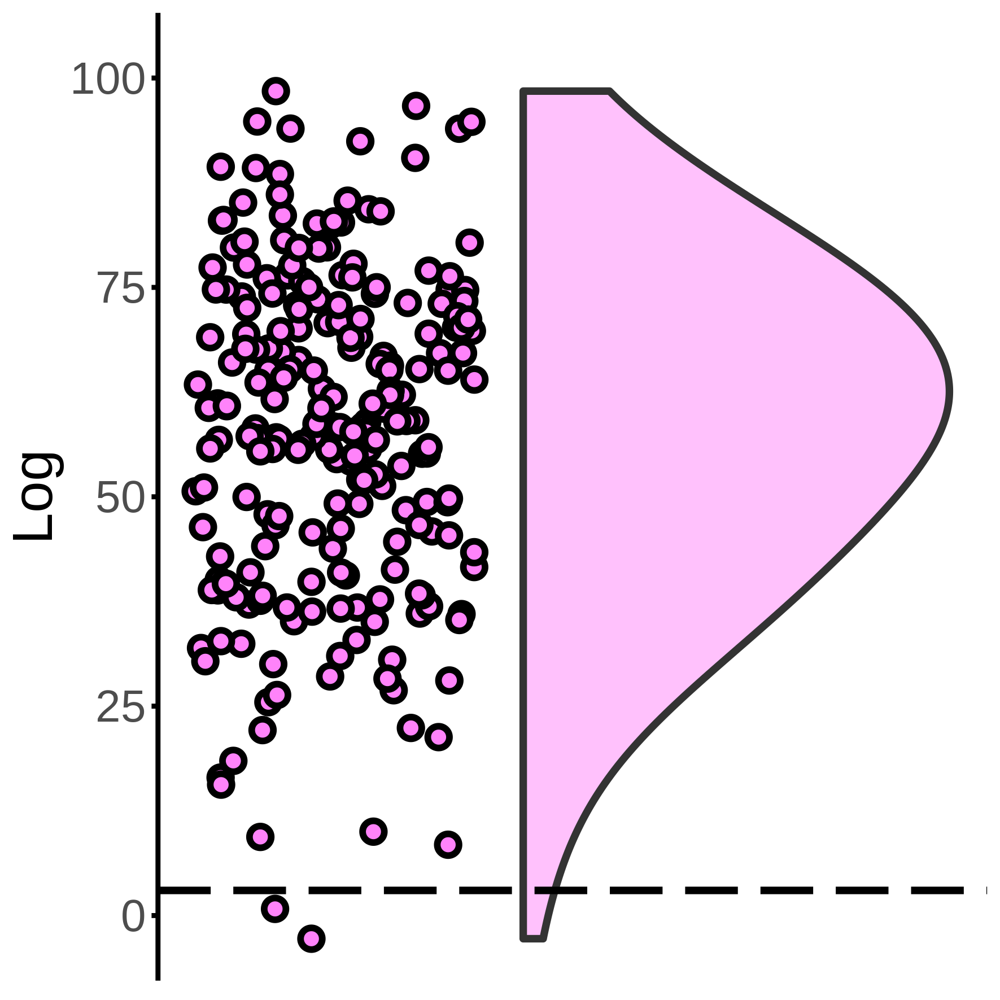
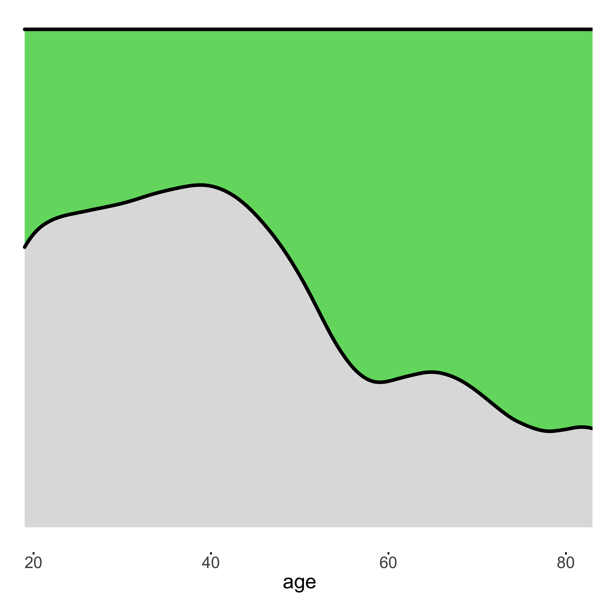

## Knights et al. (2022). Age-related Functional Compensation for Fluid Intelligence.

This repository contains code accompanying the multivariate Bayesian machine-learning project described in the following preprint:<br>
[TBC]
<br>
<br>

# **Prerequisites**
## Software
- FSL v4.0+
- Matlab (tested with r2019a)
    - SPM12 <br>
    https://www.fil.ion.ucl.ac.uk/spm/software/spm12/
    - Commonality Analysis tools <br>
    https://github.com/kamentsvetanov/CommonalityAnalysis
    - BrainNet toolbox <br>
    https://www.nitrc.org/projects/bnv/
- R
    - MASS
    - BayesFactor
    - ggeffects
    - *Popular manipulation/visualisation packages (e.g., ggplot2, dplyr, tidyverse)*

 
## Datasets
- For performing Multivariate Bayes and the preceding whole-brain univariate analysis (e.g. generating second-level models, defining ROIs, extracting timeseries), download the  Cattell first-level model images derived from automatic analysis (see Taylor et al. 2017 NeuroImage) by submitting a Cam-CAN data-request: <br>```https://camcan-archive.mrc-cbu.cam.ac.uk/dataaccess``` <br><br>
- For hypothesis testing in R, download and extract the summary datasets from:
```https://osf.io/v7kmh/```
    - Then move data to the 3 corresponding analysis directories:
        ```bash
        #For Univariate stats:
        mv univariate.csv ./R/csv/

        #For Cuneal cortex MVB stats:
        mv MVB_cuneal.csv ./MVB/70voxel_model-spare/R/csv/

        #For Frontal cortex MVB stats:
        mv MVB_frontal.csv ./MVB/control_frontalROI_70voxel_model-spare/R/csv/
        ```
<br>
<br>

# **Analysis Pipeline**
## 1) Whole-brain Univariate Analysis
Use matlab to run fMRI preprocessing and generate the group univariate contrasts (i.e., second level model generation, TFCE correction, ROI definition and timeseries extraction):<br>
```c
ccc_pipeline_20211203_ek.m

/* Alternatively, download the summary datasets described earlier the Prerequisties section.
```

## **2) Univariate Modelling**
In R, generate the regression models & plots:
<br>
```r
setwd('R')
source('loadData.R')

#For interaction: Bhv ~ age * activation
source('plot_ROI.R')

#For interaction: Bhv ~ age * gender
source('plot_bhv_2separate_withGenderInteraction.R')
```




## **3) Multivariate Bayes**
Use matlab to run the MVB machine-learning pipeline:
```c
cd MVB

setupDir.m
wrapper.m
doPostProcessing.m

/* Alternatively, download the summary datasets described earlier the Prerequisties section.
```

## **4) Multivariate Modelling**
In R, generate the logistic regression models & plots for the ROI datasets independently:
<br>
```r
#CHOOSE ONE ROI: 
setwd('./MVB/R/dropMVBSubjects-1/70voxel_model-spare') #Cuneal Cortex
setwd('./MVB/R/dropMVBSubjects-1/control_frontalROI_70voxel_model-spare') #Frontal Cortex

source('run_001_loadData.R')
```

For testing the multvariate mapping use raincloud package:

```r
source('run_MVB_shuffledMapping.R') 
```



For logistic regression of Boost likelihood use MASS/polr packages:
```r
source('run_fMRI_MVB.R')
```



<br>
<br>

# How to Acknowledge
Please cite: <br>
* *TBC*