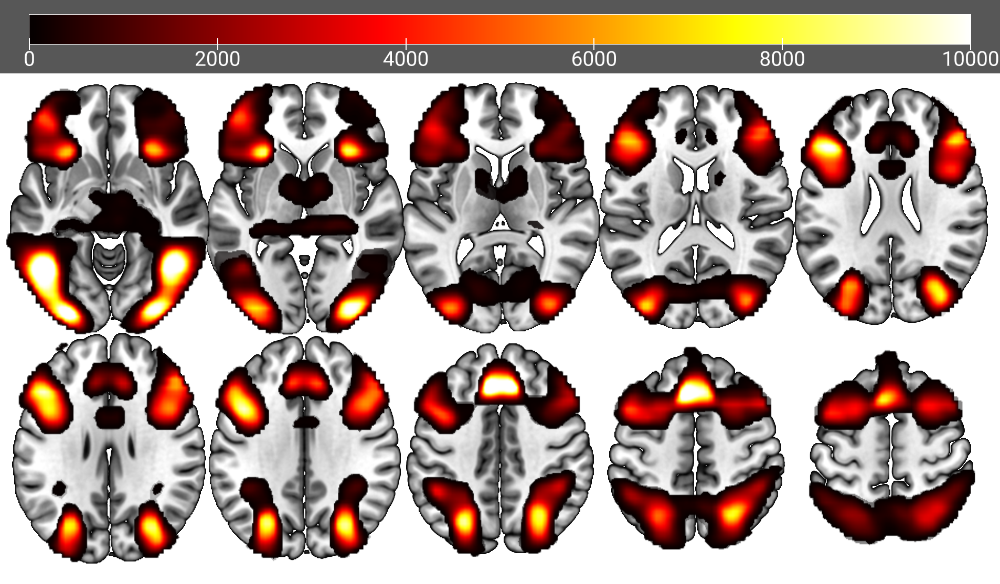
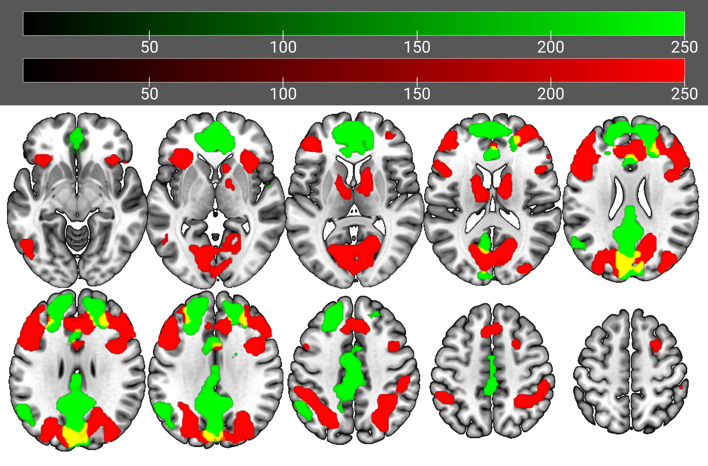
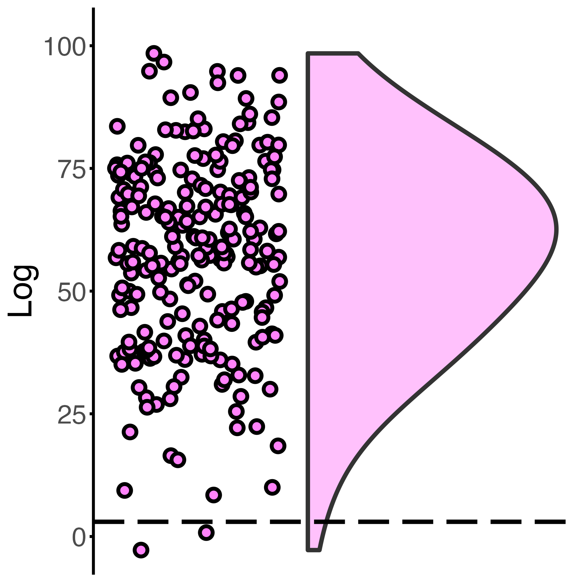
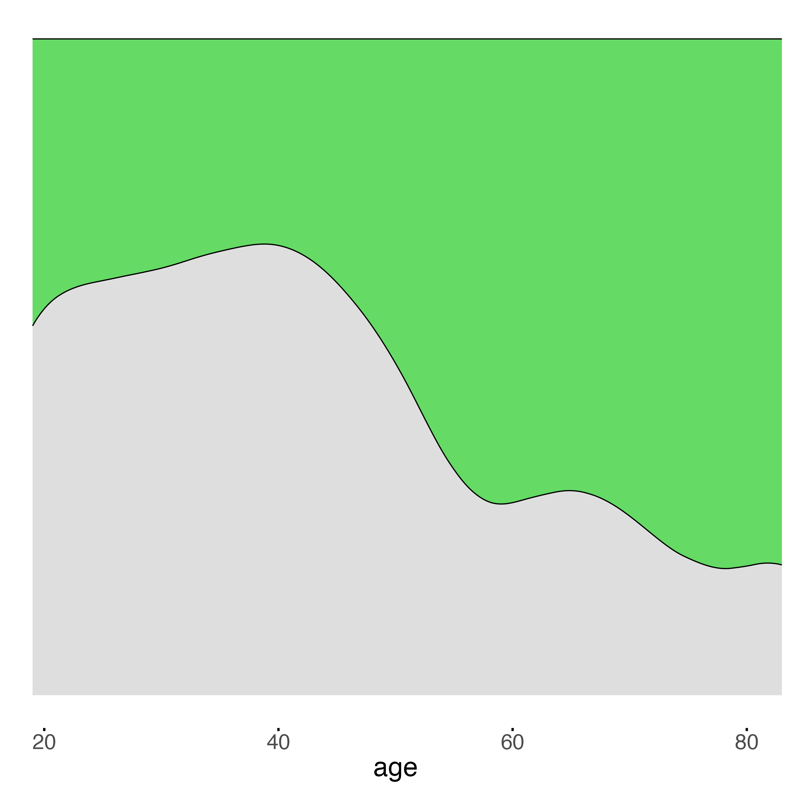

## Knights et al. (2024). Neural Evidence of Functional Compensation for Fluid Intelligence in Healthy Ageing.

This repository contains code accompanying the multivariate Bayesian machine-learning project described in the following preprint:<br>
[Knights, E., Henson, R. N., Morcom, A. M., Mitchell, D. J., & Tsvetanov, K. A. (2023). Neural Evidence of Functional Compensation for Fluid Intelligence in Healthy Ageing. bioRxiv, 2023-09.](https://www.biorxiv.org/content/10.1101/2023.09.29.560099v1.full)
<br>
<br>

# **Modelling Quickstart**
Clone & download processed fMRI/behavioural data with shell from root:
```sh
git clone https://github.com/ethanknights/Knightsetal_fMRI-Cattell-Compensation

cd Knightsetal_fMRI-Cattell-Compensation

./setup.sh
```

Use R to perform univariate/multivariate modelling analysis (see README sections 2/4 in 'Analysis Pipline') e.g.: 
```r
setwd('R')

source('load_data.R')

source('plot_ROI.R') #For interaction: activation ~ age * bhv
```

# **Prerequisites**
## Software
- FSL v4.0+
- Matlab (tested with r2019a)
    - SPM12 <br>
    https://www.fil.ion.ucl.ac.uk/spm/software/spm12/
    - Commonality Analysis tools <br>
    https://github.com/kamentsvetanov/CommonalityAnalysis
    - BrainNet toolbox <br>
    https://www.nitrc.org/projects/bnv/
- R
    - MASS
    - BayesFactor
    - ggeffects
    - *Popular manipulation/visualisation packages (e.g., ggplot2, dplyr, tidyverse)*
- Python
    - gl package (to plot t-statistic maps in mricroGL)
 
## Datasets
### Raw data for Machine-Learning
- For performing Multivariate Bayes and the preceding whole-brain univariate analysis (e.g. generating second-level models, defining ROIs, extracting timeseries), download the  Cattell first-level model images derived from automatic analysis (see Taylor et al. 2017 NeuroImage) by submitting a Cam-CAN data-request: <br>```https://camcan-archive.mrc-cbu.cam.ac.uk/dataaccess``` <br><br>
### Summary Data for Modelling
- For hypothesis testing using R, download data from the Open Science Framework (OSF).

#### Linux/Mac


```sh
./setup.sh  #Download, extract & move the summary datasets from the OSF, to their required destinations
``` 

#### Windows
- Manaully download/extract the summary_data.zip from ```https://osf.io/v7kmh/```  and move each ```.csv``` to the following corresponding analysis directories:


##### Univariate
```sh
mkdir R/csv
mv univariate.csv R/csv/
```

##### Univariate (Vascular control)
```sh
mkdir R_vascular/csv
mv univariate_vascular_RSFA.csv R_vascular/csv/
```

##### MVB
```sh
# Cuneal Cortex
mkdir MVB/R/dropMVBSubjects-1/70voxel_model-sparse/csv
mv MVB_cuneal.csv  MVB/R/dropMVBSubjects-1/70voxel_model-sparse/csv/

# Frontal cortex
mkdir MVB/R/dropMVBSubjects-1/control-frontalROI_70voxel_model-sparse/csv
mv MVB_frontal.csv MVB/R/dropMVBSubjects-1/control-frontalROI_70voxel_model-sparse/csv
```

##### MVB (Multivariate mapping)
```sh
# Cuneal Cortex
mv MVB_multvariateMapping-Cuneal/extradata_ShuffledGroupFVals.csv MVB/R/dropMVBSubjects-1/70voxel_model-sparse/csv/

# Frontal cortex
mv MVB_multvariateMapping-Frontal/extradata_ShuffledGroupFVals.csv MVB/R/dropMVBSubjects-1/control-frontalROI_70voxel_model-sparse/csv
```
# **Analysis Pipeline**
## 1) Whole-brain Univariate Analysis
Use matlab to run fMRI preprocessing and generate the group univariate contrasts (i.e., second level model generation, TFCE correction, ROI definition and timeseries extraction):<br>
```c
pipeline.m

/* Alternatively, download the summary datasets described earlier in the Prerequisties section.
```

Use Python to plot TFCE-corrected t-statistic maps with MRIcroGL.
<br>

```./python/mosaic_MRICRON_HardBIGEasy.py```
```py
gl.overlayload('./nii_HardBIGEasy/Intercept_tfce197.nii')
gl.minmax(2, 0, 10000)
gl.colorname (1,"1red")
```



```./python/mosaic_MRICRON_Covariates.py```:
```py

gl.overlayload('/nii_Covariates/tval_Age_tfce197.nii')
gl.minmax(1, 0, 250)
gl.colorname (1,"2green")

gl.overlayload('nii_Covariates/tval_PC6_tfce197.nii')
gl.minmax(2, 0, 250)
gl.colorname (2,"1red")
```



## **2) Univariate Modelling**
In R, generate the regression models & plots:
<br>
```r
setwd('R')
source('loadData.R')

#For interaction: Bhv ~ age * gender
source('plot_bhv.R')

#For interaction: Activation ~ age * bhv
source('plot_ROI.R')

#For the control vascular RSFA analysis:
setwd('R_vascular')
source('load_data_RSFA.R')
source('plot_ROI_RSFA.R')
```


## **3) Multivariate Bayes**
Use matlab to run the MVB machine-learning pipeline:
```c
cd MVB

setupDir.m
wrapper.m
doPostProcessing.m

/* Alternatively, download the summary datasets described earlier in the Prerequisties section.
```

## **4) Multivariate Modelling**
In R, generate the logistic regression models & plots for the ROI datasets independently:
<br>
```r
#CHOOSE ONE ROI: 
setwd('./MVB/R/dropMVBSubjects-1/70voxel_model-spare') #Cuneal Cortex
setwd('./MVB/R/dropMVBSubjects-1/control_frontalROI_70voxel_model-spare') #Frontal Cortex

#Load data into dataframe 'df'
source('run_loadData.R')
```

For testing the multvariate mapping, use raincloud package:

```r
source('run_MVB_shuffledMapping.R') 
```



For logistic regression of Boost likelihood, use MASS/polr packages:
```r
source('run_fMRI_MVB.R')
```



<br>

# How to Acknowledge
Please cite: <br>
[Knights, E., Henson, R. N., Morcom, A. M., Mitchell, D. J., & Tsvetanov, K. A. (2023). Neural Evidence of Functional Compensation for Fluid Intelligence in Healthy Ageing. bioRxiv, 2023-09.](https://www.biorxiv.org/content/10.1101/2023.09.29.560099v1.full)
